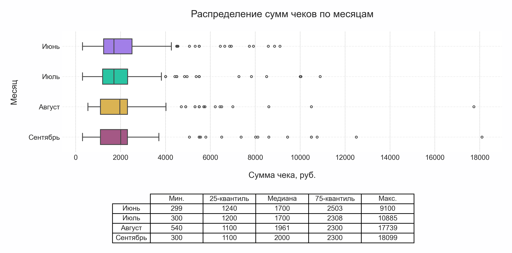
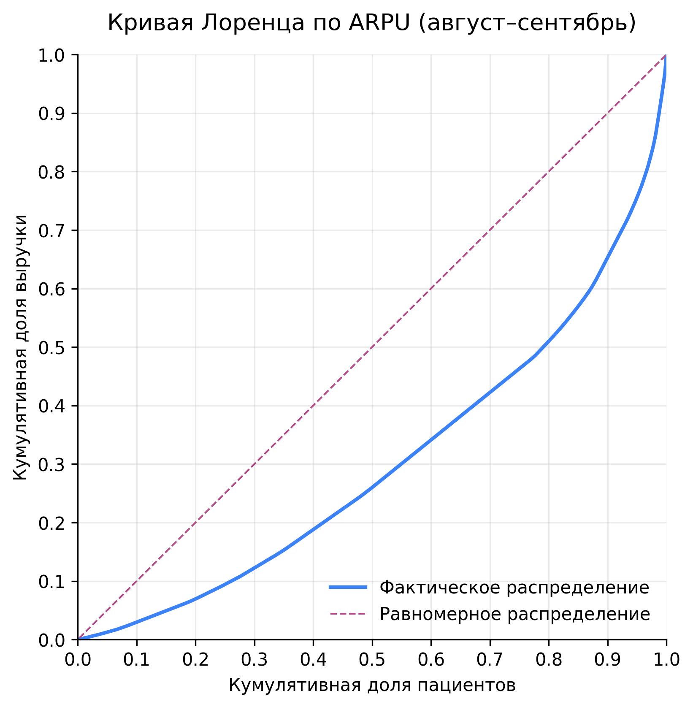
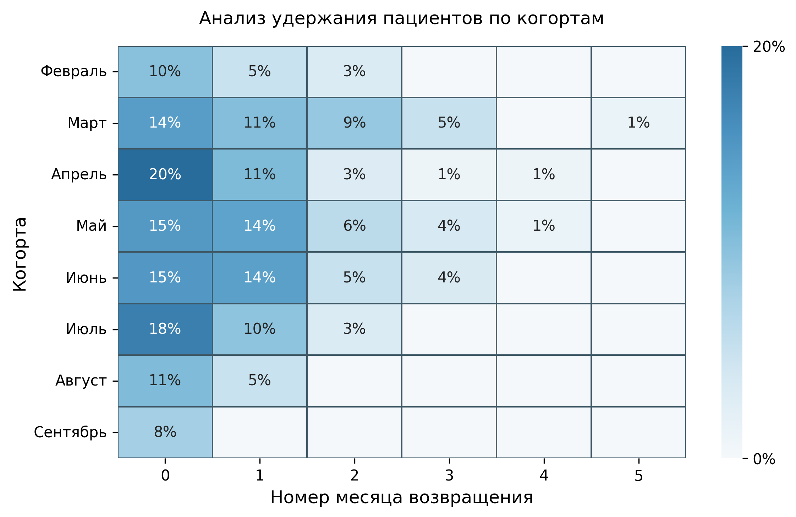

# Анализ потоков пациентов и выручки частной клиники  
**Период анализа:** январь – сентябрь 2025  
**Автор:** Павел Сабиров · Product Analyst  
**Отчёт:** [📄 Report.pdf](reports/Report.pdf)

---

## 🎯 Цель проекта
Понять, какие факторы влияют на выручку клиники, выявить сезонные закономерности и определить, что обеспечивает рост потока пациентов — количество новых обращений или удержание существующих клиентов.  
На основе данных провести исследование поведения пациентов и предложить управленческие рекомендации.

---

## 🩺 Объект и предмет анализа
- **Объект:** деятельность частной многопрофильной клиники.  
- **Предмет:** поведение пациентов, структура визитов и источники привлечения, влияющие на выручку.  

---

## 🧩 Датасеты
- `channels` — журнал записей и визитов (дата, пациент, канал записи, врач, администратор, сумма оказанных услуг).  
- `visits` — кассовые операции (дата, номер чека, пациент, врач, услуга, сумма, рекомендатель).  
- Период наблюдения: **01.01.2025 — 30.09.2025**.  
- Данные полностью **обезличены**.

---

## ⚙️ Структура проекта
```text
patient_flow_analysis/
├── anonymizer/
│   └── anonymize.ipynb                  # ноутбук для анонимизации исходных данных
│
├── data/
│   ├── raw/                             # исходные выгрузки из МИС
│   │   ├── channels.xlsx
│   │   ├── visits.xlsx
│   │   └── info.txt
│   │
│   ├── processed/                       # очищенные и подготовленные таблицы
│   │   ├── channels.csv
│   │   ├── visits.csv
│   │   ├── channels_prepared.csv
│   │   └── visits_prepared.csv
│   │
│   └── private/                         # таблицы соответствия для анонимизации
│       ├── admin_id_map.csv
│       ├── doctor_id_map.csv
│       ├── patient_id_map.csv
│       └── referrer_id_map.csv
│
├── notebooks/
│   ├── 01_EDA.ipynb                     # исследовательский анализ данных (EDA)
│   ├── 02_behavior_analysis.ipynb       # анализ потока пациентов
│   └── notes/
│       ├── hypotheses.yaml              # список гипотез для проверки
│       └── notes_during_analysis.txt    # промежуточные заметки
│
├── reports/
│   ├── main/
│   │   ├── Report.docx
│   │   └── Report.pdf                   # финальный аналитический отчёт
│   └── visualisation/                   # изображения и графики для отчёта
│
├── styles/
│   └── clinic_analytics_pitaya.mplstyle # кастомная тема для matplotlib
│
├── README.md
├── requirements.txt
├── LICENSE
└── .gitignore

---

## 🧮 Методы и ключевые метрики

| Направление анализа | Использованные подходы |
|---------------------|------------------------|
| **Качество данных** | Проверка консистентности таблиц `visits` и `channels`, поиск расхождений и пропусков, оценка полноты данных |
| **Сезонность** | Помесячное разложение визитов, анализ появления новой категории услуг (“Справки”) |
| **Структура дохода** | Анализ среднего и медианного чека, распределения по категориям услуг, построение кривой Лоренца |
| **Удержание (Retention)** | Когортный анализ повторных визитов и возвращаемости пациентов |
| **Финансовые метрики** | ARPU, медианный чек, анализ по процентилям, динамика ARPU во времени |
| **Гипотезы** | Проверка сезонности, влияния каналов привлечения и состава выручки |
| **Статистические методы** | Доверительные интервалы (Clopper-Pearson, бутстрап-оценки), χ²-тест независимости, пермутационный тест |

---

## 📊 Ключевые результаты

1. **Рост выручки в августе–сентябре** обусловлен сезонным притоком новых пациентов (категория “Справки”), а не ростом частоты визитов.  
2. **ARPU остаётся стабильным**, что указывает на количественный, а не ценовой драйвер роста.  
3. **10% пациентов формируют около 35% выручки** — высокая концентрация дохода в узкой аудитории.  
4. **Пациенты, пришедшие через агрегаторы**, возвращаются реже (28% против 72% при самостоятельной записи).  
5. **Медианный чек выше ARPU** для 50-го процентиля, что отражает неравномерность распределения выручки.  
6. **Рекомендации** направлены на повышение удержания, автоматизацию данных и стабилизацию доходов.

---

## 💡 Рекомендации

### 📋 Качество данных
- Проверить формы и точки расхождения между таблицами.  
- Дополнить систему сбора информации сведениями о каналах привлечения и расходами на услуги для дальнейшего расчета LTV/CAC.  
- Рассмотреть переход на более гибкую МИС с аналитическими модулями или параллельное ведение кастомных таблиц с текущей МИС.

### 🤝 Удержание пациентов
- Запустить программы повторных визитов и персональных предложений.  
- Внедрить follow-up коммуникации и уведомления.  
- Разработать реферальные и бонусные программы.  
- Улучшить UX сайта и информирование пациентов о направлениях клиники.

### 💰 Устойчивость доходов
- Развивать массовый сегмент услуг для снижения зависимости от узкой аудитории.  
- Продвигать комплексные программы с фиксированной ценой.
- Использовать медианные метрики вместо средних для мониторинга поведения основной группы пациентов.

---

## 🧠 Инсайты о поведении пациентов

- Выраженная **сезонность спроса** (пик в августе–сентябре).
- **Слабое удержание** — 10–20% пациентов возвращаются в течение 2–3 месяцев.  
- **Пульмонолог и терапевт** обеспечивают ~70% сопутствующих продаж.  
- Потенциал роста — в **перекрёстных назначениях** и информировании пациентов о других направлениях.
- Более дешёвые для клиники каналы записи оказываются популярны среди более лояльных пациентов.

---

## 🧰 Технологический стек

**Язык и окружение:** Python 3.11, Jupyter Notebook  
**Библиотеки:** pandas, numpy, matplotlib, seaborn, SciPy, openpyxl  

---

## ⚖️ Обоснование выбора инструментов

Некоторые популярные решения не применялись осознанно — из-за особенностей контекста проекта и целей анализа.

### 📊 BI-дашборды
**Не использовались**, так как получатель отчёта не имеет доступа к BI-инструментам.  
Визуализации выполнены в matplotlib — менее интерактивно, но более гибко и с возможностью интеграции в PDF-отчёт.

### 🧮 Статистические тесты
**Не применялись** тесты на сравнение распределений: система сбора данных ещё не стандартизирована,  
и статистическая проверка могла дать ложные выводы.  
Фокус был на **поиске управленческих инсайтов**, а не на формальной значимости.

### 🔄 Пайплайны и автоматизация
**Не внедрялись**, так как анализ был **разовым** и предполагал пересмотр архитектуры данных.  
После оптимизации процессов возможен переход к регулярным ETL-пайплайнам.

---

🎯 *Выбор инструментов подчинён цели — дать бизнесу достоверные инсайты, а не показать максимум технологий.*

---

## 📈 Примеры визуализаций

| Boxplot распределения чеков | Кривая Лоренца | Тепловая карта Retention |
|-----------------------------|----------------|---------------------------|
|  |  |  |


---

## 🔒 Конфиденциальность и использование данных

Проект основан на реальных данных, предоставленных для учебных и портфолио-целей.  
Название клиники, а также любые сведения, способные идентифицировать пациентов, врачей или сотрудников, удалены или изменены.  
Все данные полностью обезличены и не позволяют установить личность конкретных лиц или организаций.  
Проект предназначен исключительно для демонстрации аналитических компетенций в сфере продуктовой и медицинской аналитики.

---

## ⚖️ Лицензия

Проект распространяется под лицензией [MIT](LICENSE).  
Вы можете свободно использовать и модифицировать материалы в образовательных и некоммерческих целях,  
при условии сохранения уведомления об авторстве.

---

## 📬 Контакты

**Автор:** Павел Сабиров  
[GitHub](https://github.com/pavelsabirov)